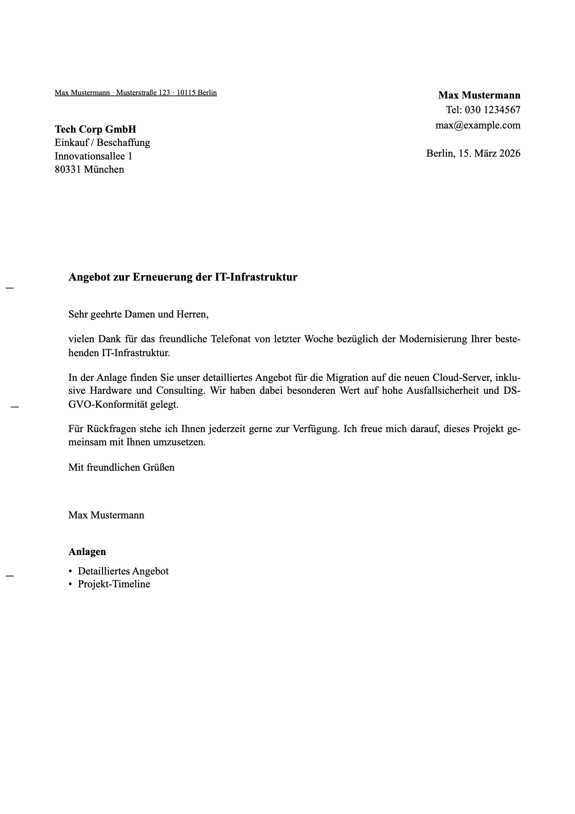

# [ din5008-generator ]

> A fast, secure, and privacy-first tool to generate perfect German business letters complying with the strict DIN 5008 (Form A) standards.

[](LICENSE)
[]()
[]()

[ EN ](#english) | [ DE ](#deutsch)

---

<a name="english"></a>
## / en

### What is this?
A simple tool that runs entirely in your browser to create clean, mathematically precise, and print-ready PDFs for formal German correspondence. It ensures your address window and folding marks are exactly where they need to be.

### Why use it?
* **100% Private (No servers):** Your sensitive business data never leaves your computer. Everything happens locally in your browser sandbox.
* **No Installation Required:** It is just a single lightweight file. No accounts, no subscriptions, no complicated installs.
* **DIN 5008 Compliant:** Guarantees absolute millimeter accuracy (`mm`) for Form A address windows, folding marks, and punch holes.

### How to use
**The most secure way to use this tool is offline:**
1. Download the [`index.html`](https://raw.githubusercontent.com/LinyingL/din5008-generator/main/index.html) file directly to your computer (Right-click -> "Save Link As...").
2. Double-click the downloaded file to open it in your web browser.
3. Fill in your sender, recipient, and letter content.
4. Click **"Als PDF / Drucken"** (Print to PDF).
   > **[!] Vital Print Setting:** To keep the exact millimeter alignment, you must set scale to **100%** (or Default) and **uncheck** "Headers and footers" in the print dialog.

*Want to just test it first?* **[`[ Try the Live Demo Here ]`](https://LinyingL.github.io/din5008-generator/)**

### Preview

*> The resulting PDF is perfectly aligned for standard window envelopes.*

### For Developers
If you want to run or modify it locally, just clone the repo and open the file:
```bash
$ git clone https://github.com/LinyingL/din5008-generator.git
$ open din5008-generator/index.html
```

---

<a name="deutsch"></a>
## / de

### Was ist das?
Ein einfaches, direkt im Browser laufendes Werkzeug, um saubere, präzise und druckfertige PDFs für deutsche Geschäftsbriefe zu erstellen. Es stellt sicher, dass das Adressfenster und die Faltmarken exakt der Norm entsprechen.

### Warum dieses Tool?
* **100% Privat (Keine Server):** Ihre sensiblen Geschäftsdaten verlassen niemals Ihren Computer. Die Verarbeitung findet komplett lokal im Browser statt.
* **Keine Installation:** Es besteht aus nur einer winzigen Datei. Keine Konten, keine Abos, keine komplizierten Installationen.
* **DIN 5008 Konform:** Garantiert absolute Millimetergenauigkeit (`mm`) für Form A Adressfenster, Falt- und Lochmarken.

### Benutzung
**Der sicherste Weg, dieses Tool zu verwenden, ist offline:**
1. Laden Sie die Datei [`index.html`](https://raw.githubusercontent.com/LinyingL/din5008-generator/main/index.html) direkt auf Ihren Computer herunter (Rechtsklick -> "Link speichern unter...").
2. Doppelklicken Sie auf die heruntergeladene Datei, um sie in Ihrem Webbrowser zu öffnen.
3. Füllen Sie Absender, Empfänger und den Inhalt Ihres Briefes aus.
4. Klicken Sie auf **"Als PDF / Drucken"**.
   > **[!] Wichtige Druckeinstellung:** Um die exakte Millimeter-Ausrichtung beizubehalten, müssen Sie die Skalierung auf **100%** (Standard) setzen und "Kopf- und Fußzeilen" im Druckdialog zwingend **deaktivieren**.

*Möchten Sie es erst testen?* **[`[ Hier geht's zur Live-Demo ]`](https://LinyingL.github.io/din5008-generator/)**

### Vorschau

*> Das generierte PDF ist perfekt auf Standard-Fensterbriefumschläge ausgerichtet.*

### Für Entwickler
Wenn Sie das Tool lokal ausführen oder anpassen möchten:
```bash
$ git clone https://github.com/LinyingL/din5008-generator.git
$ open din5008-generator/index.html
```

---

<br>

`License:` [MIT](LICENSE)
