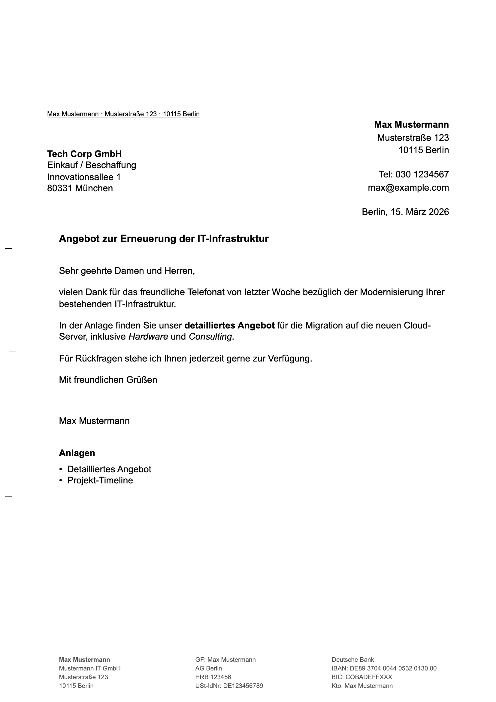

# din5008-generator

> A fast, secure, and privacy-first tool to generate perfect German business letters complying with the strict DIN 5008 standards.

[](LICENSE)
[]()
[]()

[ EN ](#english) | [ DE ](#deutsch)

---

<a name="english"></a>
## / en

### What is this?
A professional tool that runs entirely in your browser to create clean, mathematically precise, and print-ready PDFs for formal German correspondence. Designed for individuals, freelancers, and small businesses — with full DIN 5008 compliance for both Form A and Form B.

### Why use it?
* **100% Private (No servers):** Your sensitive business data never leaves your computer. Everything happens locally in your browser sandbox.
* **No Installation Required:** It is just a single lightweight file. No accounts, no subscriptions, no complicated installs.
* **DIN 5008 Compliant:** Guarantees absolute millimeter accuracy (`mm`) for Form A/B address windows, folding marks, and punch holes.
* **Smart Pagination:** Automatically splits long letters across multiple pages with correct page numbering.

### Features
| Feature | Description |
|---|---|
| 📋 **5 Templates** | Kündigung, Mahnung, Angebot, Bewerbung, Allgemein — pre-filled letter structures |
| 👤 **Sender Profiles** | Save and reload your address, phone, email, and business details |
| 📒 **Address Book** | Save frequent recipients and load them with one click |
| 🔖 **Reference Line** | DIN 5008 Bezugszeichenzeile: Ihr/Unser Zeichen, Ihr Schreiben vom |
| 🏛️ **Business Footer** | 3-column footer with legal info (GF, HRB, USt-IdNr) + bank details — required by law for GmbH/UG |
| 🖼️ **Logo Upload** | Embed your company logo (stored in the saved JSON) |
| **Bold & Italic** | Use `**bold**` and `*italic*` in letter body text |
| ⠿ **Drag & Drop** | Reorder paragraphs by dragging |
| 🌙 **Dark Mode** | Editor dark mode toggle (letter stays white for printing) |
| ⌨️ **Shortcuts** | `Ctrl+S` to save, `Ctrl+P` to print |
| 💾 **Save / Load** | Export and import letters as `.json` files |
| ↩️ **Auto-Save** | Local browser storage — your work is never lost |
| 📏 **Form A / B** | Switch between DIN 5008 Form A (higher address) and Form B (standard) |

### How to use
**The most secure way to use this tool is offline:**
1. Download the [`index.html`](https://raw.githubusercontent.com/LinyingL/din5008-generator/main/index.html) file directly to your computer (Right-click -> "Save Link As...").
2. Double-click the downloaded file to open it in your web browser.
3. Fill in your sender, recipient, and letter content.
4. Click **"Als PDF / Drucken"** (Print to PDF).
   > **[!] Vital Print Setting:** To keep the exact millimeter alignment, you must set scale to **100%** (or Default) and **uncheck** "Headers and footers" in the print dialog.

*Want to just test it first?* **[`[ Try the Live Demo Here ]`](https://LinyingL.github.io/din5008-generator/)**

### Preview

*> Full editor with live A4 preview — templates, profiles, footer, and all new features.*

### For Developers
If you want to run or modify it locally, just clone the repo and open the file:
```bash
$ git clone https://github.com/LinyingL/din5008-generator.git
$ open din5008-generator/index.html
```

---

<a name="deutsch"></a>
## / de

### Was ist das?
Ein professionelles, direkt im Browser laufendes Werkzeug, um saubere, präzise und druckfertige PDFs für deutsche Geschäftsbriefe zu erstellen. Konzipiert für Privatpersonen, Freelancer und kleine Unternehmen — mit vollständiger DIN 5008-Konformität für Form A und Form B.

### Warum dieses Tool?
* **100% Privat (Keine Server):** Ihre sensiblen Geschäftsdaten verlassen niemals Ihren Computer. Die Verarbeitung findet komplett lokal im Browser statt.
* **Keine Installation:** Es besteht aus nur einer einzigen Datei. Keine Konten, keine Abos, keine komplizierten Installationen.
* **DIN 5008 Konform:** Garantiert absolute Millimetergenauigkeit (`mm`) für Form A/B Adressfenster, Falt- und Lochmarken.
* **Automatische Paginierung:** Lange Briefe werden automatisch korrekt auf mehrere Seiten aufgeteilt.

### Funktionen
| Funktion | Beschreibung |
|---|---|
| 📋 **5 Vorlagen** | Kündigung, Mahnung, Angebot, Bewerbung, Allgemein — vorbefüllte Briefstrukturen |
| 👤 **Absender-Profile** | Eigene Absenderdaten speichern und per Klick laden |
| 📒 **Adressbuch** | Häufige Empfänger speichern und direkt auswählen |
| 🔖 **Bezugszeichenzeile** | Ihr/Unser Zeichen, Ihr Schreiben vom — nach DIN 5008 |
| 🏛️ **Geschäftsfußzeile** | 3-spaltige Fußzeile mit Pflichtangaben (GF, HRB, USt-IdNr) + Bankverbindung |
| 🖼️ **Logo-Upload** | Firmenlogo einbetten (wird im JSON gespeichert) |
| **Fett & Kursiv** | `**fett**` und `*kursiv*` im Brieftext verwenden |
| ⠿ **Drag & Drop** | Absätze per Ziehen neu anordnen |
| 🌙 **Dark Mode** | Editor-Dunkeldesign (Brief bleibt weiß für den Druck) |
| ⌨️ **Tastenkürzel** | `Strg+S` zum Speichern, `Strg+P` zum Drucken |
| 💾 **Speichern / Laden** | Briefe als `.json` exportieren und importieren |
| ↩️ **Auto-Sicherung** | Lokaler Browser-Speicher — Ihre Arbeit geht nie verloren |
| 📏 **Form A / B** | Umschalten zwischen DIN 5008 Form A (hochgestellt) und Form B (Standard) |

### Benutzung
**Der sicherste Weg, dieses Tool zu verwenden, ist offline:**
1. Laden Sie die Datei [`index.html`](https://raw.githubusercontent.com/LinyingL/din5008-generator/main/index.html) direkt auf Ihren Computer herunter (Rechtsklick -> "Link speichern unter...").
2. Doppelklicken Sie auf die heruntergeladene Datei, um sie in Ihrem Webbrowser zu öffnen.
3. Füllen Sie Absender, Empfänger und den Inhalt Ihres Briefes aus.
4. Klicken Sie auf **"Als PDF / Drucken"**.
   > **[!] Wichtige Druckeinstellung:** Um die exakte Millimeter-Ausrichtung beizubehalten, müssen Sie die Skalierung auf **100%** (Standard) setzen und "Kopf- und Fußzeilen" im Druckdialog zwingend **deaktivieren**.

*Möchten Sie es erst testen?* **[`[ Hier geht's zur Live-Demo ]`](https://LinyingL.github.io/din5008-generator/)**

### Vorschau

*> Vollständiger Editor mit Live-A4-Vorschau — Vorlagen, Profile, Fußzeile und alle neuen Funktionen.*

### Für Entwickler
Wenn Sie das Tool lokal ausführen oder anpassen möchten:
```bash
$ git clone https://github.com/LinyingL/din5008-generator.git
$ open din5008-generator/index.html
```

---

<br>

`License:` [MIT](LICENSE)
